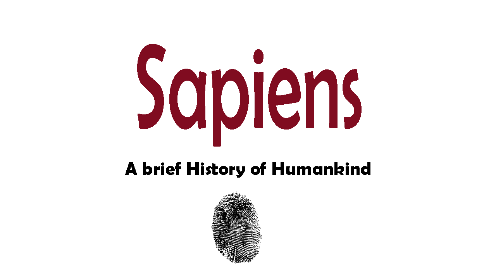
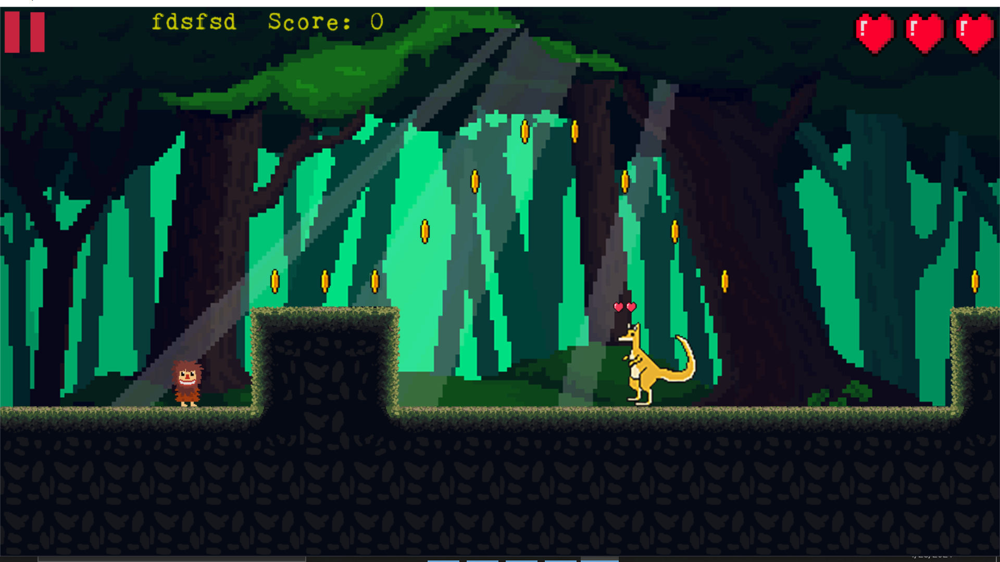
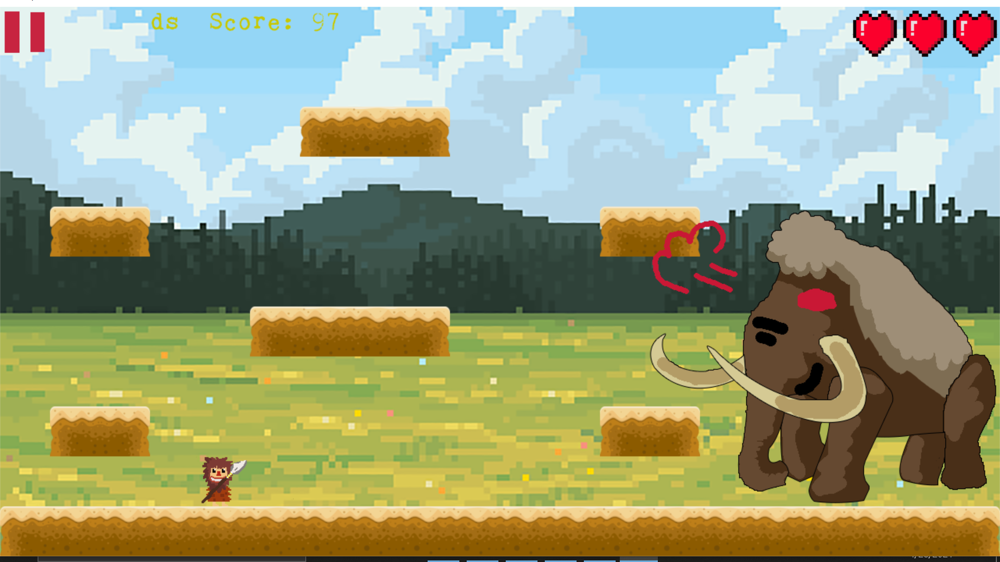

# sSapienSs
sSapienSs is a c++ game with [SDL](https://www.libsdl.org/) library.

## About Game:

sSapienSs is a game about the History of Human. Playing this game not only make you have fun but also teach you about the history

## Credit to:
[phattrienphanmem](https://www.youtube.com/channel/UC8uCXZWa9KYhE1TYvu7PCdQ)

[lazyfoo](https://lazyfoo.net/tutorials/SDL/02_getting_an_image_on_the_screen/index.php)

## Expected Score: 10

